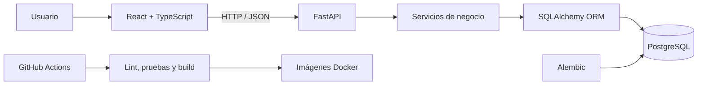

# FitPlan

FitPlan es una aplicación web que genera planes semanales de entrenamiento personalizados y adapta las siguientes rutinas con base en el desempeño registrado por el usuario.

El proyecto fue desarrollado como un MVP aplicando prácticas de arquitectura de software, bases de datos, pruebas automatizadas, contenedores, integración continua y metodología DevOps.

## Objetivo

Proporcionar una herramienta que permita:

- Crear un perfil físico y deportivo.
- Seleccionar equipo disponible y restricciones físicas.
- Generar rutinas semanales personalizadas.
- Consultar ejercicios, series, repeticiones, descansos y carga recomendada.
- Registrar los resultados reales de cada entrenamiento.
- Adaptar automáticamente las siguientes semanas.
- Consultar el historial y progreso del usuario.

## Funcionalidades implementadas

### Autenticación

- Registro de usuarios.
- Confirmación de correo en modo de desarrollo.
- Inicio de sesión mediante JWT.
- Consulta del usuario autenticado.
- Cierre de sesión e invalidación del token.
- Validación de correos duplicados y credenciales incorrectas.

### Perfil

- Edad.
- Género.
- Peso y altura.
- Nivel de experiencia.
- Objetivo principal.
- Lugar de entrenamiento.
- Días disponibles.
- Duración de las sesiones.
- Equipo disponible.
- Restricciones o molestias físicas.

### Planes de entrenamiento

- Generación automática de rutinas semanales.
- Series, repeticiones, descansos y RPE objetivo.
- Filtrado de ejercicios según equipo y restricciones.
- Navegación entre semanas anteriores y actuales.
- Conservación del historial de planes.
- Versionado automático de las rutinas.

### Sesiones e historial

- Entrenamiento guiado.
- Videos o imágenes de los ejercicios.
- Registro de peso utilizado.
- Selector de kilogramos y libras.
- Conversión automática sin perder el valor ingresado.
- Registro de series y repeticiones realizadas.
- Dificultad, energía y satisfacción.
- Reporte de dolor o molestia.
- Historial por semana, mes o periodo completo.
- Calendario de entrenamientos completados.

### Adaptación automática

FitPlan utiliza los resultados registrados para modificar futuras recomendaciones:

- Incrementa cargas cuando el rendimiento es favorable.
- Mantiene la recomendación cuando el desempeño es estable.
- Reduce cargas o volumen cuando existe dificultad elevada o dolor.
- Conserva las semanas anteriores para consultar la evolución.

## Arquitectura



La solución utiliza una arquitectura cliente-servidor:

- **Frontend:** interfaz web y experiencia del usuario.
- **Backend:** API REST, autenticación y lógica de negocio.
- **Base de datos:** persistencia de usuarios, perfiles, planes y sesiones.
- **Alembic:** control de versiones del esquema.
- **Docker Compose:** ejecución coordinada de los servicios.
- **GitHub Actions:** integración continua y validación automática.

## Tecnologías

### Frontend

- React.
- TypeScript.
- Vite.
- CSS.
- ESLint.

### Backend

- Python 3.12.
- FastAPI.
- SQLAlchemy.
- Pydantic.
- JWT.
- Alembic.
- Ruff.
- Pytest.
- Coverage.

### Infraestructura y DevOps

- PostgreSQL.
- Docker.
- Docker Compose.
- Git.
- GitHub.
- GitHub Actions.
- Estrategia de ramas basada en `main`, `develop` y `feature/*`.

## Estructura principal

```text
fitplan/
├── .github/
│   └── workflows/
│       └── ci.yml
├── apps/
│   ├── api/
│   │   ├── alembic/
│   │   ├── app/
│   │   │   ├── api/routes/
│   │   │   ├── core/
│   │   │   ├── db/
│   │   │   ├── models/
│   │   │   ├── schemas/
│   │   │   └── services/
│   │   ├── tests/
│   │   ├── alembic.ini
│   │   ├── Dockerfile
│   │   └── pyproject.toml
│   └── web/
│       ├── public/
│       ├── src/
│       ├── Dockerfile
│       └── package.json
├── .env.example
├── docker-compose.yml
└── README.md
```

## Requisitos

Para ejecutar el proyecto mediante contenedores se necesita:

- Git.
- Docker Desktop o Docker Engine.
- Docker Compose.

Para ejecutar herramientas fuera de Docker:

- Python 3.12.
- Node.js 22 o superior.
- npm.

## Instalación con Docker

### 1. Clonar el repositorio

```bash
git clone https://github.com/patricioalvarezvidales/fitplan.git
cd fitplan
```

### 2. Crear el archivo de entorno

```bash
cp .env.example .env
```

Para una instalación real se deben sustituir las contraseñas y claves de ejemplo por valores seguros.

### 3. Construir e iniciar los servicios

```bash
docker compose up --build
```

También puede iniciarse en segundo plano:

```bash
docker compose up --build -d
```

### 4. Consultar el estado

```bash
docker compose ps
```

## Direcciones locales

- Aplicación web: `http://localhost:5173`
- API: `http://localhost:8000`
- Documentación Swagger: `http://localhost:8000/docs`
- Salud de la API: `http://localhost:8000/api/v1/health`
- Salud de PostgreSQL: `http://localhost:8000/api/v1/health/database`

## Variables de entorno

El archivo `.env.example` contiene la configuración necesaria para el entorno local.

Las variables principales incluyen:

- Configuración de PostgreSQL.
- URL de conexión a la base de datos.
- Clave secreta para JWT.
- Duración de los tokens.
- Orígenes permitidos por CORS.
- URL de la API consumida por el frontend.
- Entorno de ejecución.

No deben subirse contraseñas ni secretos reales al repositorio.

## Migraciones con Alembic

Aplicar todas las migraciones:

```bash
docker compose exec api alembic upgrade head
```

Consultar la versión actual:

```bash
docker compose exec api alembic current
```

Verificar que los modelos y las migraciones estén sincronizados:

```bash
docker compose exec api alembic check
```

Al iniciar el contenedor de la API, FitPlan aplica automáticamente las migraciones pendientes antes de levantar FastAPI.

## Pruebas del backend

Ejecutar todas las pruebas:

```bash
docker compose exec api pytest
```

Ejecutar pruebas con cobertura:

```bash
docker compose exec api pytest --cov=app --cov-report=term-missing
```

Validar el mínimo configurado para integración continua:

```bash
docker compose exec api pytest --cov=app --cov-report=term-missing --cov-fail-under=90
```

Resultado validado durante el desarrollo:

```text
17 pruebas aprobadas
96% de cobertura
```

Las pruebas utilizan una base PostgreSQL temporal y aislada, la cual se crea antes de la ejecución y se elimina al finalizar.

## Calidad del backend

```bash
docker compose exec api ruff check .
```

## Calidad del frontend

```bash
cd apps/web
npm ci
npm run lint
npm run build
```

## Integración continua

El workflow ubicado en `.github/workflows/ci.yml` se ejecuta en:

- Cambios enviados a ramas `feature/**`.
- Cambios enviados a `develop`.
- Cambios enviados a `main`.
- Pull requests dirigidos a `develop` o `main`.
- Ejecución manual desde GitHub Actions.

El pipeline valida:

1. Instalación de dependencias.
2. Disponibilidad de PostgreSQL.
3. Migraciones de Alembic.
4. Sincronización entre modelos y migraciones.
5. Ruff.
6. Pytest.
7. Cobertura mínima del 90%.
8. ESLint.
9. Build del frontend.
10. Configuración de Docker Compose.
11. Construcción de las imágenes de producción.

## Estrategia de ramas

```text
feature/* → develop → main
```

- `feature/*`: desarrollo de funciones o correcciones.
- `develop`: integración y validación del proyecto.
- `main`: versión estable y entregable.

Los cambios deben pasar el pipeline de integración continua antes de fusionarse.

## Flujo de uso

1. Crear una cuenta.
2. Confirmar el correo mediante el flujo de desarrollo.
3. Iniciar sesión.
4. Completar el perfil.
5. Seleccionar equipo y restricciones.
6. Generar una rutina semanal.
7. Abrir una sesión.
8. Registrar pesos, series, repeticiones y retroalimentación.
9. Finalizar el entrenamiento.
10. Consultar el historial.
11. Generar la siguiente semana adaptada.

## Endpoints principales

### Autenticación

- `POST /api/v1/auth/register`
- `POST /api/v1/auth/confirm-email`
- `POST /api/v1/auth/login`
- `GET /api/v1/auth/me`
- `POST /api/v1/auth/logout`

### Perfil y catálogo

- `GET /api/v1/catalog`
- `GET /api/v1/profile`
- `PUT /api/v1/profile`

### Planes y sesiones

- `POST /api/v1/plans/generate`
- `GET /api/v1/plans`
- `GET /api/v1/plans/current`
- `GET /api/v1/plans/{plan_id}`
- `POST /api/v1/sessions/{session_id}/complete`
- `GET /api/v1/history`

## Limitaciones del MVP

- La confirmación del correo se realiza en modo de desarrollo.
- No se incluye un proveedor SMTP real.
- No existe recuperación de contraseña.
- No hay panel administrativo.
- La aplicación está preparada principalmente para ejecución local mediante Docker.
- Los ejercicios y reglas de adaptación utilizan un catálogo inicial.
- Las recomendaciones no sustituyen una valoración médica o profesional.

## Seguridad y salud

FitPlan no sustituye la atención de un médico, fisioterapeuta o entrenador certificado.

El sistema puede evitar ejercicios marcados como incompatibles con ciertas restricciones, pero el usuario debe detener el entrenamiento ante dolor agudo, mareo o cualquier síntoma anormal.

En un despliegue de producción deben utilizarse:

- Contraseñas robustas.
- Claves JWT seguras.
- HTTPS.
- Variables de entorno protegidas.
- Servicio SMTP confiable.
- Base de datos con acceso restringido.
- Copias de seguridad periódicas.

## Estado del proyecto

- MVP funcional: completado.
- Docker Compose: completado.
- Migraciones Alembic: completado.
- Pruebas automatizadas: 17 aprobadas.
- Cobertura del backend: 96%.
- Integración continua: aprobada.
- Conversión kg/lb: validada.
- Historial y calendario: completados.
- Adaptación de cargas: validada.

## Autor

**Patricio Álvarez Vidales**

Repositorio: `patricioalvarezvidales/fitplan`

## Licencia

Proyecto desarrollado con fines académicos.
