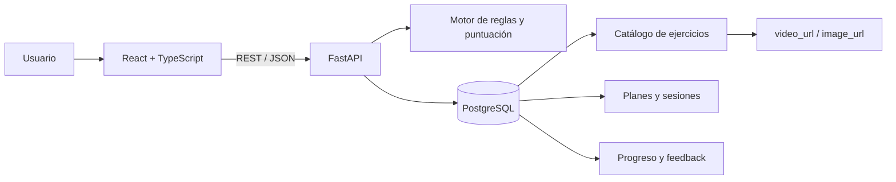

# Arquitectura inicial

## Decisiones

- Monorepo para simplificar coordinación, CI y documentación.
- API REST separada del frontend.
- PostgreSQL por la naturaleza relacional de usuarios, ejercicios, planes y registros.
- Docker Compose para reproducir el ambiente local.
- Videos almacenados como URL en el MVP; cada ejercicio tendrá una imagen de respaldo.
- El núcleo adaptativo será determinista y explicable, no una llamada directa a IA generativa.
